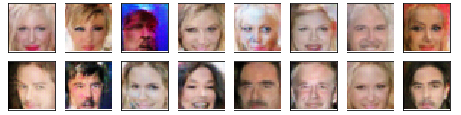
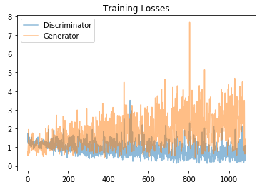

# Face-Generation-in-Pytorch
In this project, I defined and trained a DCGAN on a CelebA dataset. 
The goal of this project is to get a generator network to generate new images of faces that look as realistic as possble.          
Below are some examples of newly generated faces[after only 12 epohcs] : 

### Model architecture :
  - Discriminator: 5-Layer CNN - Given a face image, distinguishes it as a real or a fake (generated) image
  - Generator: 4-Layer CNN - Given a latent vector z, generates a new face image from learned weights from images in training set.
  It tries to trick the Dircriminator to think that the generated image is REAL.
  
### Hyperparameters :
  - Batch Size = 20 
  - Generated Image Size = 32 x 32
  - num_epochs = 12
  - learning_rate = 0.0005 with Adam optimizer : [beta1, beta2] = [0.1, 0.999]
  - Length of latent vector z = 100
  - Number of Filters in Discriminator's first hidden layer = 32
  - Number of Filters in Generator's first hidden layer = 32
  - added batch normalization
  
### Training :
  Training involved alternating between training the discriminator and the generator.
  - epochs : 12
  
  
### Dataset :
  - CelebA dataset [http://mmlab.ie.cuhk.edu.hk/projects/CelebA.html]
    
 
  
